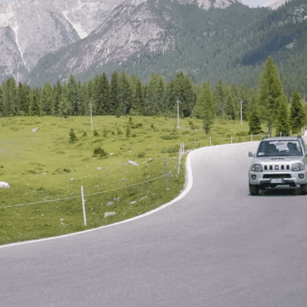
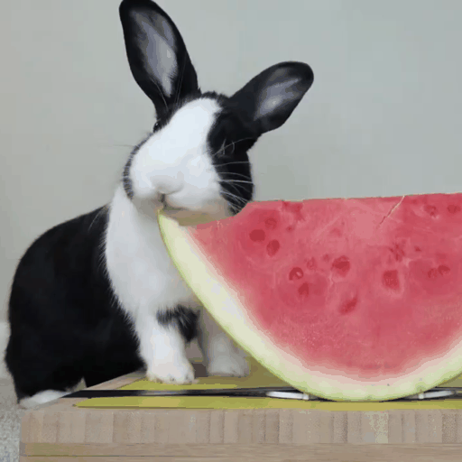
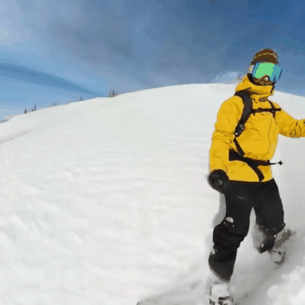
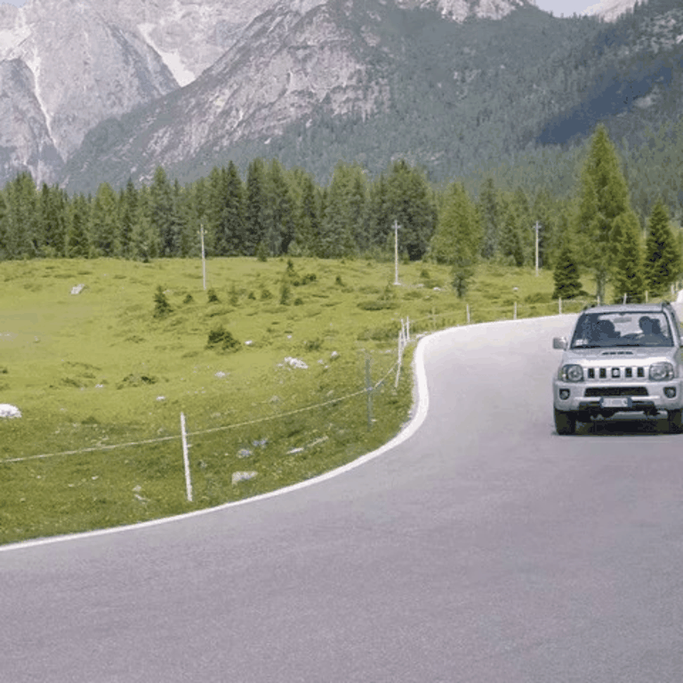
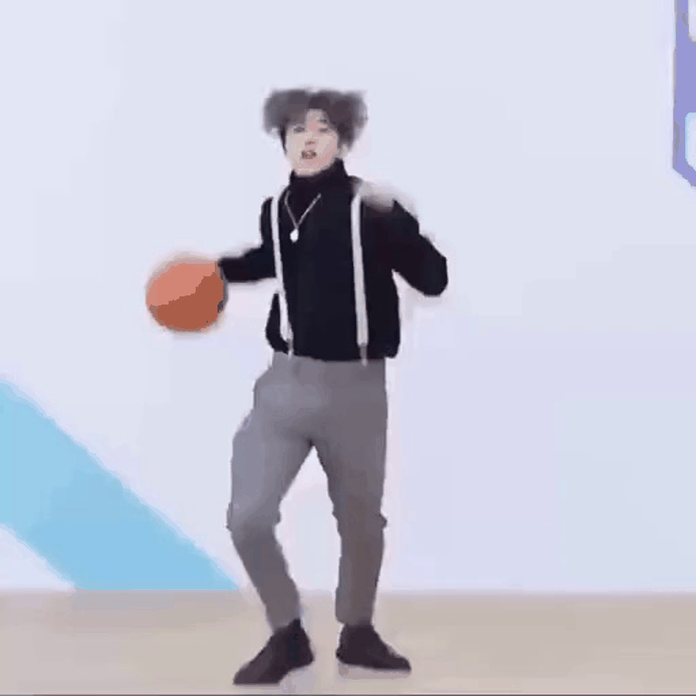
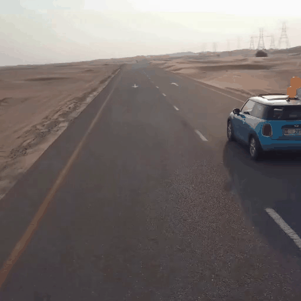

# SmoothVideo

This repository is the official implementation of **Smooth Video Synthesis with Noise Constraints on Diffusion Models for One-shot Video Tuning**.


## Setup
This implementation is based on [Tune-A-Video](https://github.com/showlab/Tune-A-Video).

### Requirements

```shell
pip install -r requirements.txt
```

Installing [xformers](https://github.com/facebookresearch/xformers) is highly recommended for more efficiency and speed on GPUs. 
To enable xformers, set `enable_xformers_memory_efficient_attention=True` (default).

### Weights

**[Stable Diffusion]** [Stable Diffusion](https://arxiv.org/abs/2112.10752) is a latent text-to-image diffusion model capable of generating photo-realistic images given any text input. The pre-trained Stable Diffusion models can be downloaded from Hugging Face (e.g., [Stable Diffusion v1-5](https://huggingface.co/runwayml/stable-diffusion-v1-5))).


## Usage

### Training

To fine-tune the text-to-image diffusion models for text-to-video generation, run this command for the baseline model:
```bash
accelerate launch train_tuneavideo.py --config="configs/man-skiing.yaml"
```

Run this command for the baseline model with the proposed smooth loss:
```bash
accelerate launch train_tuneavideo.py --config="configs/man-skiing.yaml" --smooth_loss
```

Run this command for the baseline model with the proposed simple smooth loss:
```bash
accelerate launch train_tuneavideo.py --config="configs/man-skiing.yaml" --smooth_loss --simple_manner
```


Note: Tuning a 24-frame video usually takes `300~500` steps, about `10~15` minutes using one A100 GPU. 
Reduce `n_sample_frames` if your GPU memory is limited.

### Inference

Once the training is done, run inference:

```python
from tuneavideo.pipelines.pipeline_tuneavideo import TuneAVideoPipeline
from tuneavideo.models.unet import UNet3DConditionModel
from tuneavideo.util import save_videos_grid
import torch

pretrained_model_path = "./checkpoints/stable-diffusion-v1-5"
my_model_path = "./outputs/man-skiing"
unet = UNet3DConditionModel.from_pretrained(my_model_path, subfolder='unet', torch_dtype=torch.float16).to('cuda')
pipe = TuneAVideoPipeline.from_pretrained(pretrained_model_path, unet=unet, torch_dtype=torch.float16).to("cuda")
pipe.enable_xformers_memory_efficient_attention()
pipe.enable_vae_slicing()

prompt = "spider man is skiing"
ddim_inv_latent = torch.load(f"{my_model_path}/inv_latents/ddim_latent-500.pt").to(torch.float16)
video = pipe(prompt, latents=ddim_inv_latent, video_length=24, height=512, width=512, num_inference_steps=50, guidance_scale=7.5).videos

save_videos_grid(video, f"./{prompt}.gif")
```


## Results

### Tune-A-Video
<table class="center">
<tr>
	<td > <b>Input video </b></td>
	<td colspan="4" style="text-align:center;" ><b> Tune-A-Video </b></td>
</tr>
<tr>
  <td></td>
  <td></td>
  <td></td>
  <td></td>
  <td></td>
</tr>
<tr>
	<td > <b> Input video </b> </td>
  <td colspan="4" style="text-align:center;" ><b> Tune-A-Video + <span style="color: red;">smooth loss</span> </b> </td>
</tr>
<tr>
  <td></td>
  <td></td>
  <td></td>
  <td></td>
  <td></td>
</tr>
<tr>
	<td width=20% style="text-align:center;"> a jeep car is moving on the road</td>
	<td width=20% style="text-align:center;"> a jeep car is moving on the <span style="color: red;">beach</span> </td>
	<td width=20% style="text-align:center;"> a jeep car is moving on the <span style="color: red;">snow</span> </td>
	<td width=20% style="text-align:center;"> a jeep car is moving on the road, <span style="color: red;">cartoon style</span> </td>
	<td width=20% style="text-align:center;"> a <span style="color: red;">sports car</span> is moving on the road </td>
</tr>
<tr>
	<td > <b>Input video </b></td>
	<td colspan="4" style="text-align:center;"><b> Tune-A-Video </b></td>
</tr>
<tr>
  <td></td>
  <td></td>
  <td></td>
  <td></td>
  <td></td>
</tr>
<tr>
	<td > <b> Input video </b> </td>
  <td colspan="4" style="text-align:center;"><b> Tune-A-Video + <span style="color: red;">smooth loss</span> </b> </td>
</tr>
<tr>
  <td></td>
  <td></td>
  <td></td>
  <td></td>
  <td></td>
</tr>
<tr>
	<td width=20% style="text-align:center;"> a rabbit is eating a watermelon</td>
	<td width=20% style="text-align:center;"> a <span style="color: red;">tiger</span> is eating a watermelon </td>
	<td width=20% style="text-align:center;"> a rabbit is eating an <span style="color: red;">orange</span> </td>
	<td width=20% style="text-align:center;"> a rabbit is eating a <span style="color: red;">pizza</span> </td>
	<td width=20% style="text-align:center;"> a <span style="color: red;">puppy</span> is eating an <span style="color: red;">orange</span></td>
</tr>
<tr>
	<td > <b>Input video </b></td>
	<td colspan="4" style="text-align:center;"><b> Tune-A-Video </b></td>
</tr>
<tr>
  <td></td>
  <td></td>
  <td></td>
  <td></td>
  <td></td>
</tr>
<tr>
	<td > <b> Input video </b> </td>
  <td colspan="4" style="text-align:center;"><b> Tune-A-Video + <span style="color: red;">smooth loss</span> </b> </td>
</tr>
<tr>
  <td></td>
  <td></td>
  <td></td>
  <td></td>
  <td></td>
</tr>
<tr>
	<td width=20% style="text-align:center;"> a man is skiing</td>
	<td width=20% style="text-align:center;"> <span style="color: red;">mickey mouse</span> is skiing on the snow </td>
	<td width=20% style="text-align:center;"> <span style="color: red;">spider man</span> is skiing on the <span style="color: red;">beach, cartoon style</span> </td>
	<td width=20% style="text-align:center;"> <span style="color: red;">wonder woman, wearing a cowboy hat</span>, is skiing </td>
	<td width=20% style="text-align:center;"> a man, <span style="color: red;">wearing pink clothes</span>, is skiing <span style="color: red;">at sunset</span> </td>
</tr>


**We provide other baseline results comparisons, as follows:**


### Make-A-Protagonist

<table class="center">
<tr>
	<td> <b>Input video </b></td>
	<td style="text-align:center"><b> Make-A-Protagonist </b></td>
  <td style="text-align:center"><b> Make-A-Protagonist + <span style="color: red;">smooth loss</span></b></td>
</tr>
<tr>
  <td></td>
  <td></td>
  <td></td>
</tr>
<tr>
	<td> a jeep driving down a mountain road</td>
	<td colspan="2" style="text-align:center"> a jeep driving down a mountain road <span style="color: red;">in the rain</span> </td>
</tr>
<tr>
	<td></td>
  <td></td>
  <td></td>
</tr>
<tr>
	<td>A man is playing basketball</td>
	<td colspan="2" style="text-align:center"> A man is playing a basketball <span style="color: red;">on the beach, anime style</span></td>
</tr>
<tr>
  <td></td>
  <td></td>
  <td></td>
</tr>
<tr>
	<td>a man walking down the street at night</td>
	<td colspan="2" style="text-align:center"> a <span style="color: red;">panda</span> walking down the <span style="color: red;">snowy street</span> </td>
</tr>
<tr>
  <td></td>
  <td></td>
  <td></td>
</tr>
<tr>
	<td>a man waling down the street</td>
  <td colspan="2" style="text-align:center"> <span style="color: red;">elon musk</span> walking down the street </td>
</tr>


### ControlVideo

<table class="center">
<tr>
	<td > <b>Input video </b></td>
	<td width=25% style="text-align:center"><b> Condition </b></td>
	<td width=25% style="text-align:center"><b> ControlVideo</b></td>
  <td width=25% style="text-align:center"><b> ControlVideo + <span style="color: red;">smooth loss</span></b></td>
</tr>
<tr>
  <td></td>
	<td></td>
	<td></td>
	<td></td>
</tr>
<tr>
	<td>a person is dancing</td>
	<td> Pose condition </td>
  <td colspan="2" style="text-align:center"> <span style="color: red;">Michael Jackson</span> is dancing </td>
</tr>
<tr>
  <td></td>
  <td></td>
  <td></td>
  <td></td>
</tr>
<tr>
	<td>a person is dancing</td>
	<td> Pose condition</td>
  <td colspan="2" style="text-align:center"> a person is dancing, <span style="color: red;">Makoto Shinkai style</span> </td>
</tr>
<tr>
  <td></td>
  <td></td>
  <td></td>
  <td></td>
</tr>
<tr>
	<td>a building</td>
	<td> Canny edge condition</td>
  <td colspan="2" style="text-align:center"> a <span style="color: red;">wooden</span> building, <span style="color: red;">at night</span> </td>
</tr>
<tr>
  <td></td>
  <td></td>
  <td></td>
	<td></td>
</tr>
<tr>
	<td>a girl</td>
	<td> Hed edge condition</td>
  <td colspan="2" style="text-align:center"> a girl, <span style="color: red;">Krenz Cushart style</span></td>
</tr>
<tr>
  <td></td>
  <td></td>
  <td></td>
  <td></td>
</tr>
<tr>
	<td>a girl</td>
	<td> Hed edge condition</td>
  <td colspan="2" style="text-align:center"> a girl <span style="color: red;">with rich makeup</span></td>
</tr>
<tr>
  <td></td>
  <td></td>
  <td></td>
  <td></td>
</tr>
<tr>
	<td>ink diffuses in water</td>
	<td> Depth condition</td>
  <td colspan="2" style="text-align:center"> <span style="color: red;">gentle green</span> ink diffuses in water, <span style="color: red;">beautiful light</span></td>
</tr>


### Video2Video-zero

<table class="center">
<tr>
	<td width=20% style="text-align:center;word-wrap: break-word;"><b>Input video </b></td>
	<td width=20% style="text-align:center;word-wrap: break-word;"><b> InstructVideo2Video-zero </b></td>
	<td width=20% style="text-align:center;word-wrap: break-word;"><b> InstructVideo2Video-zero + noise constraint </b></td>
	<td width=20% style="text-align:center;word-wrap: break-word;"><b> VideoInstructPix2Pix </b></td>
	<td width=20% style="text-align:center;word-wrap: break-word;"><b> VideoInstructPix2Pix + noise constraint </b></td>
</tr>
<tr>
	  <td></td>
  	<td></td>
    <td></td>
  	<td></td>
    <td></td>
</tr>
<tr>
  <td >  </td>
  <td colspan="4"> <b>Instruct:</b> make it animation</td>
</tr>
</table>


</table>


## Acknowledgements

- This code builds on [Tune-A-Video](https://github.com/showlab/Tune-A-Video) and [diffusers](https://github.com/huggingface/diffusers). Thanks for open-sourcing!
